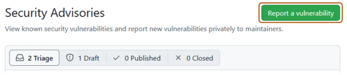

# Security Policy

## Reporting a Vulnerability

If you find a security vulnerability, please responsibly disclose it using GitHub's Security Advisory platform:

1. Go to Security tab of the repository.
2. Open the Advisories page
3. Click the button 'Report a vulnerability'

 

**Do not create a public GitHub issue.**

In addition to reporting through GitHub, please notify our Open Source Program Office (OSPO) by sending an email to [ospo@allianz.com](mailto:ospo@allianz.com).

Thank you for helping to make this project more secure!